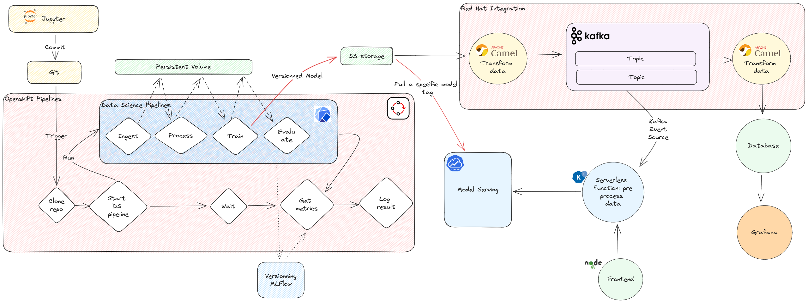
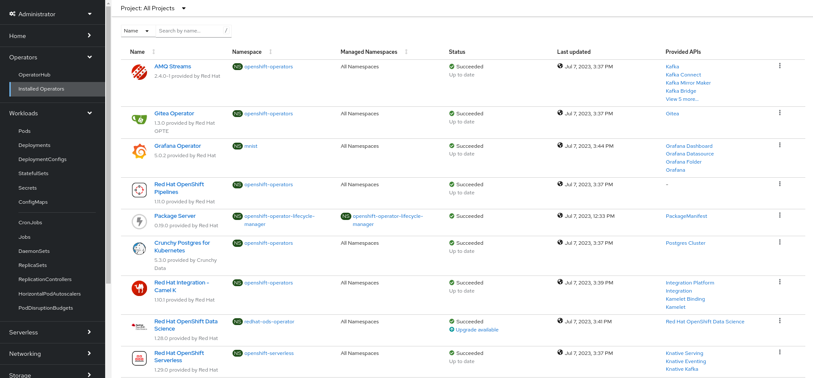

# An MLOPS journey

## Table of content

1. [About](#about)
2. [User story](#user-story)
3. [Architecture](#architecture)
4. [Walkthrough](#walkthrough)
5. [Deployment](#deployment)  

## About

This demo demonstrates an end to end automated MLOps approach for model training and inference. It leverages Red Hat Openshift Data Science (RHODS) as well as other products from Red Hat portfolio. 

## User story

A data scientist setup his Jupyter envrionement and develops his model. Once statisfied he commits his code and makes a pull request to merge into the production branch. The pull request automatically triggers a data science pipeline. During the training process, the model is tagged and stored into a bucket storage. A model server is serving this model and reconciles whenerer it is updated. The new model is automatically served and is consumable through api requests. It becomes a scalable model that can be used for live inference or batch streaming.

## Architecture



## Walkthrough

Walkthourgh and highlights can be found on [this documentation](./docs/walkthrough.md).

## Deployment

The following procedure will deploy all the demo components. If you want to deploy only specific components, look at [this documentation](./manifests/readme.md).

### Operators 

Install the operators.

```shell
oc apply -k ./manifests/operators/
```

Wait for the installations to complete. Confirm that all operators are ready. Compare your operators status to this screenshot. 




### Operator instances

Deploy the data science cluster and the knative instances by runnning:

```shell
oc apply -k ./manifests/operators-instances/
```

### Demo environment.


Deploy the demo instances:

```shell
oc kustomize ./manifests/instances/ --enable-helm | oc apply -f -
```