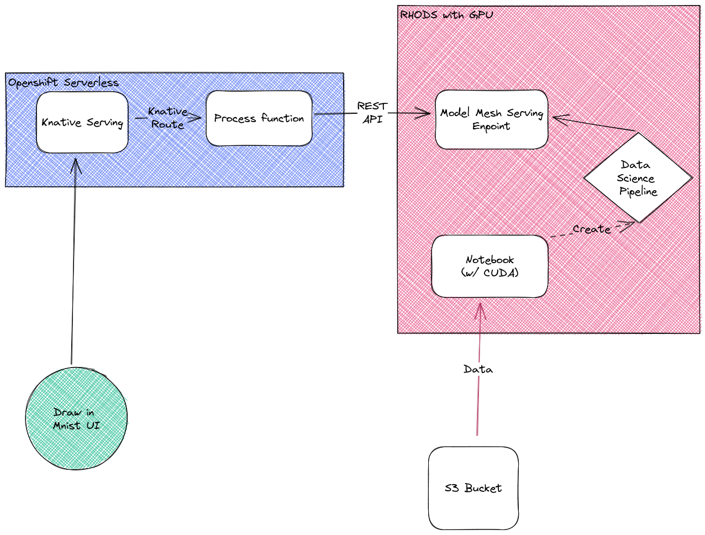
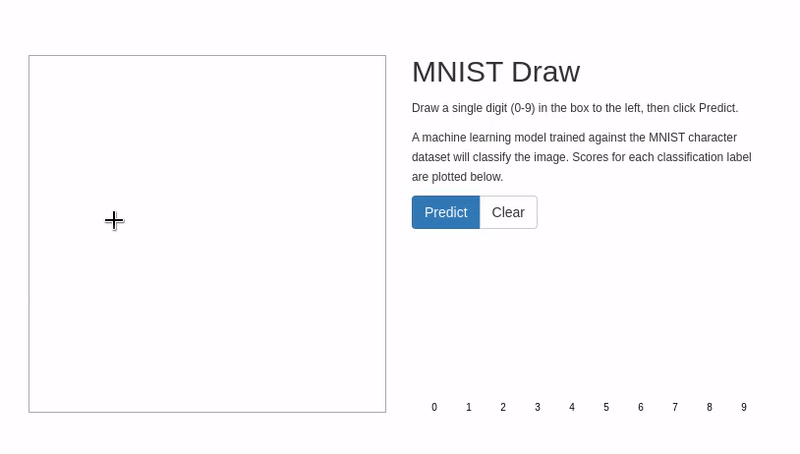

## Introduction

This lab demonstrates how to build and serve a machine learning model through pipelines (MLOPS) by leveraging Openshift Data Science (RHODS). We will deploy a web application as an example of interactions with the model through REST API calls. This web application is a nodejs frontend that calls a Knative service endpoint linked to a serverless function. The serverless function acts as a pre-processor of the data between the client and the model. In more concrete terms, the model is a neural network to predict handwritten digits and the webapp is a UI where you can draw and make a predictions.  

Furthermore, we have the abilty to use GPU hardware thanks to Nvida GPU Operator, Node Feature Discovery and the Cuda library.



## Lab instruction

Follow the lab instructions here: [lab instructions](./docs/lab-instructions.md).  
Through this lab you will construct, train, deploy, serve and consume a predictive model. Finnaly you will be able to interact with it thanks to the UI.




## Deploy on your own cluster

### Deploy operators and their CR

Install the operators and their custom resources:

```shell
# First deploy the operators and wait for completion
oc apply -f ./pre-requisites/operators/
# Then deploy few operators CRDs and wait for completion
oc apply -f ./pre-requisites/operators-instance/
```

### Deploy the data Science Project

Set your cluster name and base domain in openshift-data-science/kustomization.yaml or run: 
```shell
sed -i 's/CLUSTER_NAME/PUT_YOUR_CLUSTER_NAME_HERE/g' openshift-data-science/kustomization.yaml
sed -i 's/BASE_DOMAIN/PUT_YOUR_BASE_DOMAIN_HERE/g' openshift-data-science/kustomization.yaml
```

```shell
# Deploy the data science components
oc apply -k ./openshift-data-science/
```

### Do the lab

You can now go to this link and do the lab: [Lab instructions](./docs/lab-instructions.md)


## Reset lab

**Warning:** This will delete all your work.  
When finished, you can clean your lab by running:

```shell
# Reset configurations
oc apply -k ./lab-reset/
# Reset job
oc create -f ./lab-reset/reset-job.yaml
# Reset cron job
oc create -f ./lab-reset/reset-cron-job.yaml
```

## Reference

Notebook originally from Thmomas Masson on kaggle: https://www.kaggle.com/code/tcmaso/mnist-guide-cnn-augmentation-tuning-99-5