# Lab Instructions

## Log in to Red Hat OpenShift Data Science (RHODS)

On the top right of the screen click on the XXX button and launch Red Hat OpenShift Data Science (RHODS). Select on my_htpasswd_provider and connect with the hpe_redhat user.

## Start a new data science project

Go to the **Data Science projects** tab and click on the pre-created **mnist** project. This project has been created with a pvc for the notebook filesystem (i.e the jupyterlab notebooks). It also contains a S3 secret corresponding the the minio credentials deployed in the *redhat-ods-applications* namespace.  
You need to create a new workbench. Click on the corresponding button and fill up. Don't forget to link the pre-created pvc to the notebook. Complete the form as bellow:

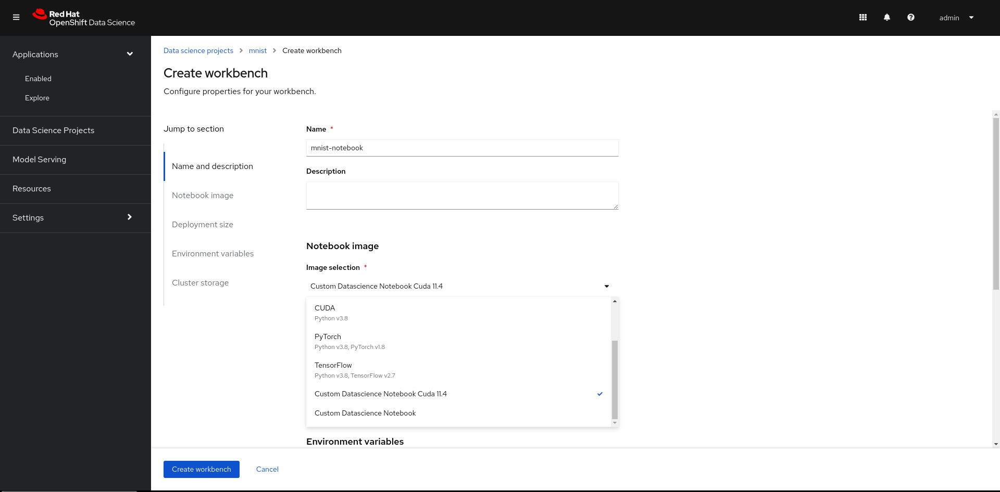

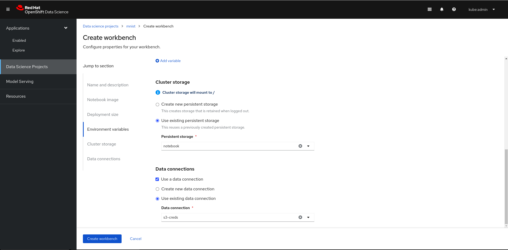

You also have to add the S3 credentials for the notebook you just created. This will restart the notebook as the credentials will the mount on a volume from a secret pre-created for you. See the picture bellow:


RHODS is going to pull a few container images especially the one used for the jupyterlab notebook server. After a few moment the workbench is running and you can open it.

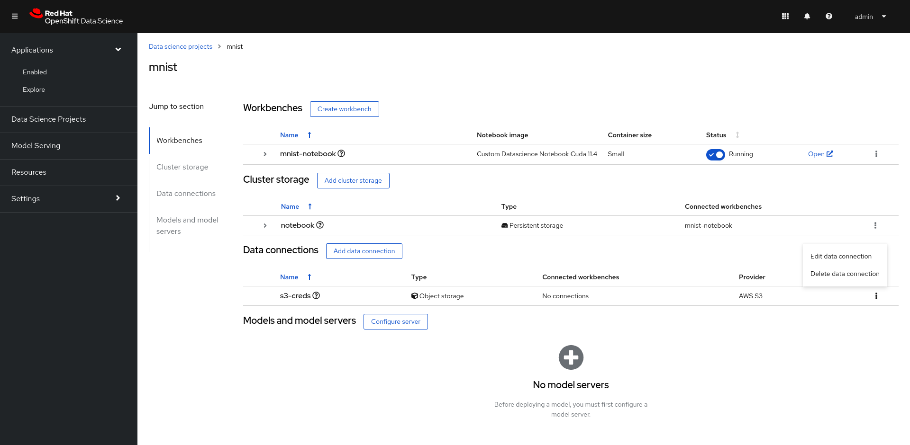

## JupyterLab notebooks

On the left side click on the git clone button and clone this repository: https://github.com/adrien-legros/rhods-mnist.git. Navigate to *./rhods-mnist/notebooks/v2*. Check the following files.

### Notebooks

There are 3 notebooks available: Pre-process, Train and Metadata. Navigate to each of the notebooks to understand what's going on.

#### Pre-process

Load and pre-process the data. The data are loaded from minio s3 bucket. In the notebook, we are describing the data and running basic analysis such as counting the number of observation per label. We also transform the data by normalizing and reshaping them. We store the python numpy objects in a bucket so it is available to the others notebooks (i.e available to next pipeline steps).

#### Train

We load the processed data, create, and train the ML model. The model is a convolutional neural network. See the architecture of the model and the different layers. Once the model is trained, we display few metrics such as the f1 score or the confusion matrix.  
The model is saved in the minio bucket in the onnx format so that we can serve it later on this lab.

#### Metadata

This notebook tells Kubeflow to store some metadata. It is specific for the piepline and decoupled from the other notebooks so that the data scientist work is independant of the pipeline configurations.

### Elyra pipeline

Display the pipeline by openning the file *mnist.pipeline*.
It is a pipeline generated thanks to Elyra visual editor. You can see how the notebooks are linked together. 
If you right click on a "node" you can open the properties tab. You can check that there are some envrionemental variables referenced by a secret name and key. These are the credentials of the minio S3 bucket where we will store some processed data as well as the model in onnx format.  
See also that we need to reference a Runtime Image where the python code will run.

## Complete and run the pipeline

### Edit default pipeline properties

Open the pipeline properties panel by clicking on the *Open Panel* button, or right clicking to a node, select *Open Properties* and switch tab to *Pipeline Properties*.

#### Edit default Runtime Image

In the Runtime Image, add by default *Custom Runtime for mnist : CUDA11.4/Py38*.

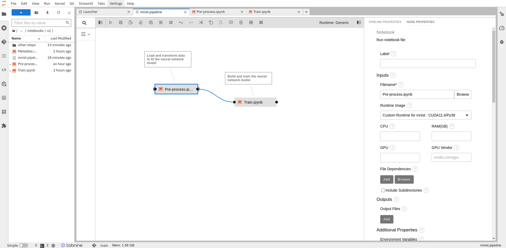


#### Edit the S3 endpoint url

Get your minio server endpoint url. Go to the **Administrator Console > Networking > Routes** in the *redhat-ods-applications* namespace. Copy the minio route url. Or run the following command:
```shell
oc -n mnist get route mnist -ojsonpath='{.status.ingress[0].host}'
```
Edit the AWS_S3_ENDPOINT environmental variable value by replacing it with the route endpoint you just copied.

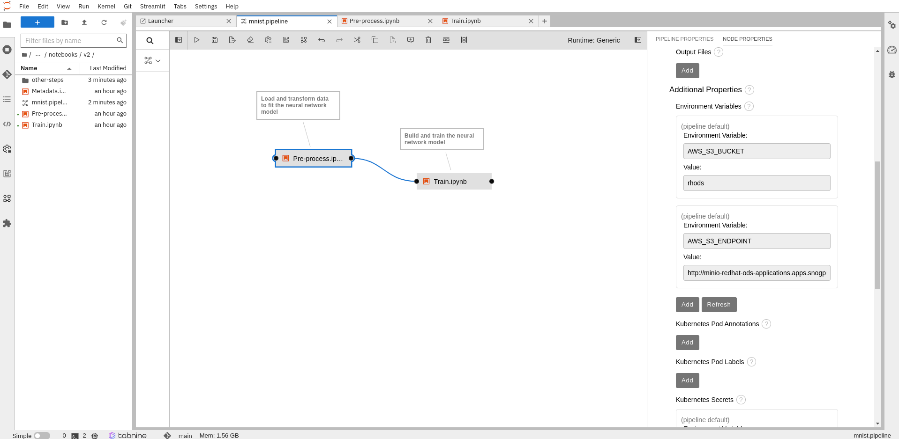

### Add a pipeline step

We are going to add the metadata playbook to our pipeline. Open the *mnist.pipeline* file. You can add a step by grabbing a playbook from the file browser to the UI. Add the *Metadata.ipynb* notebook. Then bind it to the ouput of the *Train.ipynb* step. Open the *Metadata.ipynb* node properties by right clicking on the object. Add the following properties: 
- Runtime Image: Ensure the *Custom Runtime for mnist : CUDA11.4/Py38* runtime image is selected
- Output Files: Add *tmp/logs/fit/* as output files. This path is used to store Tensorflow logs in the pipeline metadata. We will be able to visualize our logs through a Tensorboard.  

Additionnaly, confirm that environmental variables has been set by default.

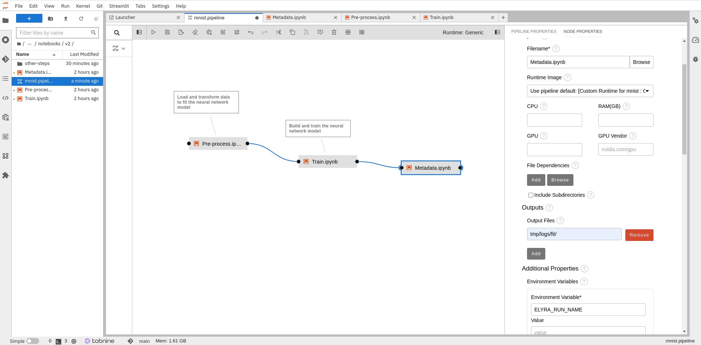

### Add Kubeflow Runtime

We need to setup the Kuflow Runtime so that Elyra can call Kubeflow Pipeline API to create an experiment and run it. On the left navigation bar, click on Runtimes. Add a new Kubeflow Pipeline runtime configuration. You will need the Kubeflow API endpoint as well as the Minio endpoint and credentials. To get the endpoints, go to **Administrator Console > Networking > Routes** in the *redhat-ods-applications* namespace. Or run the commands:
```shell
echo MINIO_ENDPOINT: http://$(oc -n redhat-ods-applications get route minio -ojsonpath='{.status.ingress[0].host}')
echo KUBEFLOW_API_ENDPOINT: http://$(oc -n redhat-ods-applications get route ds-pipeline -ojsonpath='{.status.ingress[0].host}')
```
Select Tekton as Pipeline engine and *rhods* as the bucket name. COS username is minio and password is minio123.
Fill up the form as shown in the screenshots:

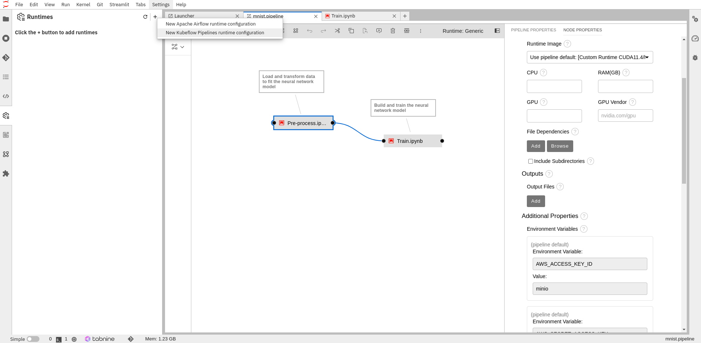

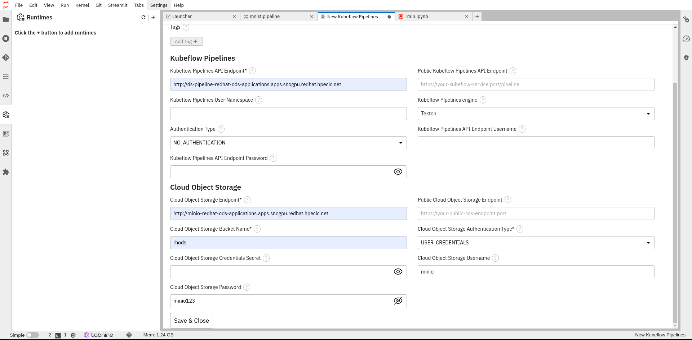

Save and close the tab.

### Run the pipeline

Go back to the pipeline and run it.

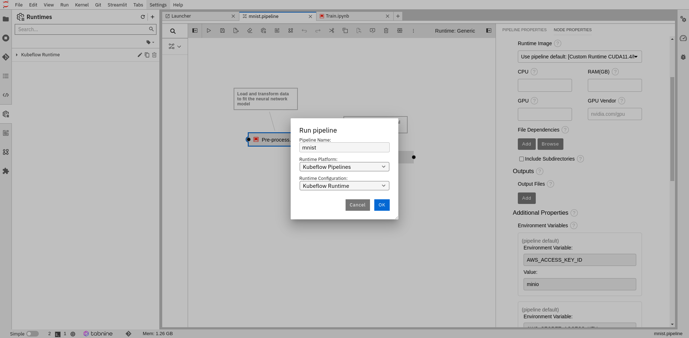

## Navigate to Kubeflow Pipeline

Go to **Administrator Console > Networking > Routes** in the *redhat-ods-applications* namespace. Open the *ds-pipeline-ui* url to open Kubeflow Pipeline. Alternatively, get the url with:
```shell
oc -n redhat-ods-applications get route ds-pipeline-ui -ojsonpath='{.status.ingress[0].host}'
```
Navigate to the **Runs** tab. A new run has been launched for you by Elyra. Click on it. You can see a graph with your pipeline steps. The graph is updated step by step so you only see the Pre-process step during the first 1-2 minutes.  
Check out the logs by clicking on a step, then on the log tab.

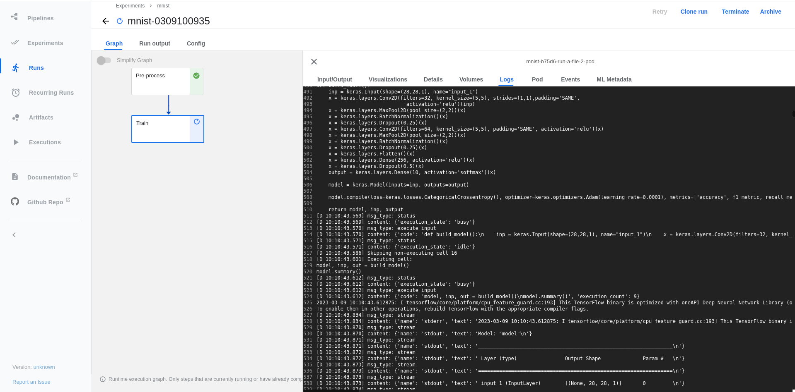

The pipeline completed after approximatively 5 minutes with the GPU enabled.

Click on the **Run Ouput** tab. Notice that few metadata artifacts has been created throughout the pipeline. By default, you can retrieve all logs in html or ipynb format. Click on a link to redirect to minio bucket.  
Also notice that a tensorboard is availble. We have deployed a visualization server and a custom resource associated. We will use this server to visualize the model metrics by run and compare them.

Go to **Administrator Console > Networking > Routes** in the *redhat-ods-applications* namespace. Open the *my-viewer* url to open the Visualization server. **WARNING:** Don't forget the /tensorboard/my-viewer/ path at the end of the hostname.  
Alternatively, get the url with:
```shell
echo https://$(oc -n redhat-ods-applications get route my-viewer -ojsonpath='{.status.ingress[0].host}')/tensorboard/my-viewer/
```

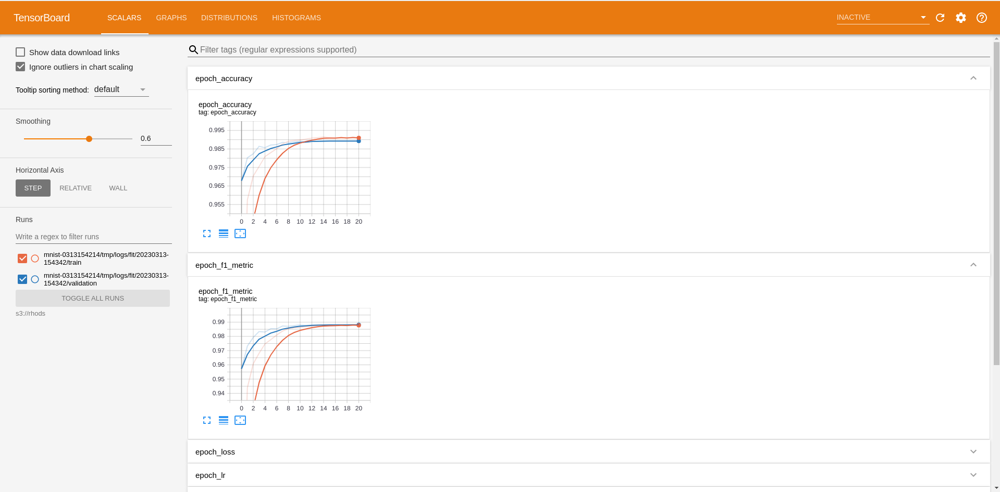

## Model Serving

Now it is time to serve our model using modelmesh serving. Go back to RHODS dashboard. Click on **Configure server**. Make the model available via external route and secure it with a token authorization. The token authoriezation uses oauth proxy as backend. Choose model-mesh as service account name. Finally click on configure:

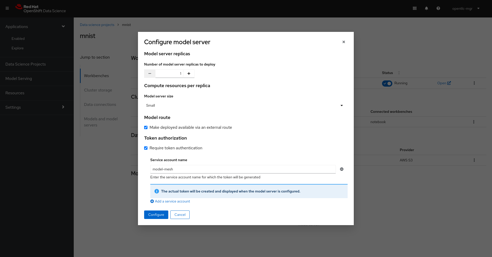

Then click on **Deploy model**. Enter *mnist* as model name. Select *onnx - 1* as model framework. In the Train.ipynb notebook we trained and saved a model in the onnx format. We converted a tensorflow model in the onnx format. The onnx model is saved in the minio S3 bucket at the path *onnx/model-v2.onnx*. Let's add the s3 bucket as the data connection and *onnx/model-v2.onnx* as the folder path. Deploy the model. Wait for the model deployment to complete. You can now see the model endpoint as well as the token associated with the service account created.  
**NOTE:** The service account resource as not been created. The model server has created a secret named *model-mesh* containing the token, certificate etc.

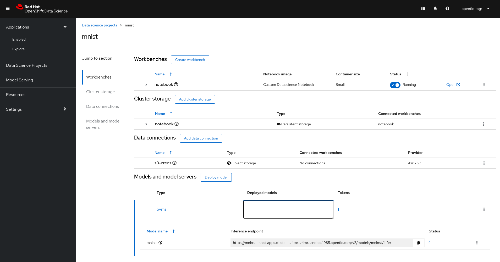
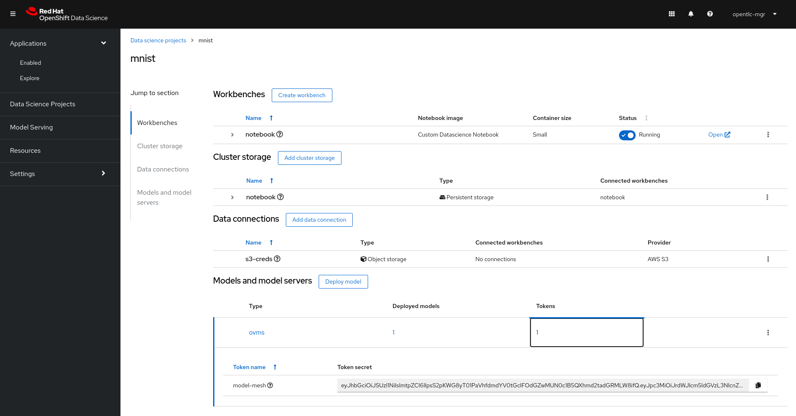

## Interact with the model

### Deploy the serverless function

The goal of this serverless function is to act as a lightweight pre-processing function between the web interface (that acts as a frontend) and the model serving. We need a pre processing function to transform the data drown in the UI that are in png format into a tensor understandable by the model. Recall that we defined our neural network that way:

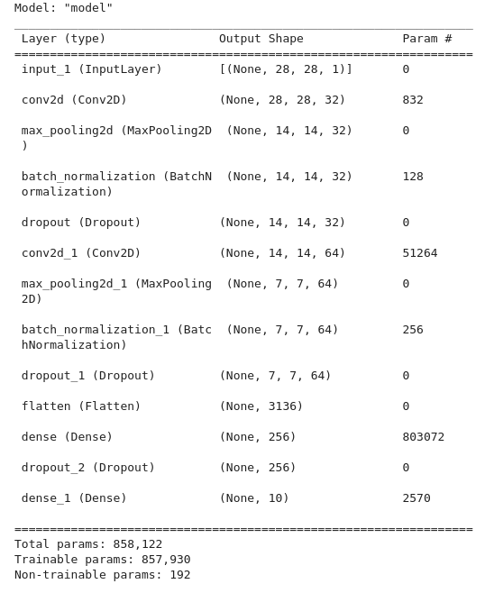

The ONNX framework is adequation with this architecutre. Therefore the model server is expecting as input a [1, 28, 28, 1] shape tensor nammed *input_1*.  
For more information conerning the serverless function check out the openshift-serverless/functions/app-src directory. The file *preprocessing.py* contains the 2 most important functions:
- process_data: convert the png format to a well shaped tensor
- process_payload: take the template expected by modelmesh serving and add the processed data

Before deploying the serverless function, modify ./openshift-serverless/manifests/kustomization.yaml.  
Change the modelmesh inference endpoint with the url displayed in the RHODS dashboard. Confirm that the 2 other variables are correctly set.

Now deploy the serverless function:
```shell
oc apply -k ./openshift-serverless/manifests/
```

## Deploy the webapp

Deploy the frontend web application:

```shell
oc apply -k ./webapp/v2/manifests/
```

Get the route endpoint and visit the url!

```shell
oc -n mnist get route mnist-webapp -ojsonpath='{.status.ingress[0].host}'
```

Draw a digit between 1 and 9. Click on predict and see te ouput. Note: the first prediction can take more time as the serverless function might not be running. The following predictions will be much faster.

## Clean Up