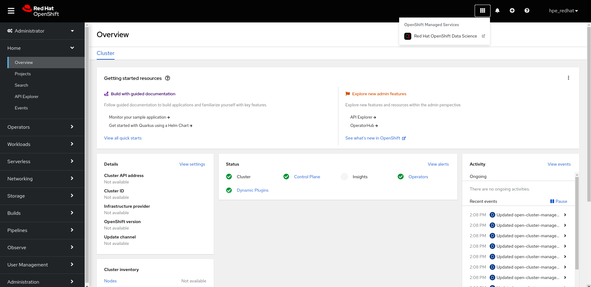
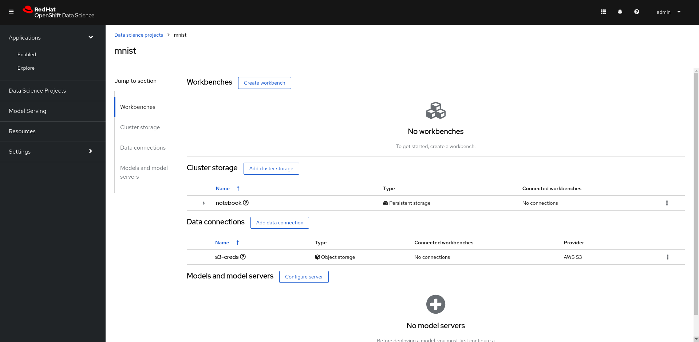
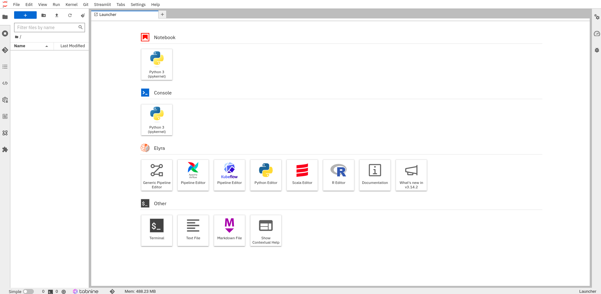
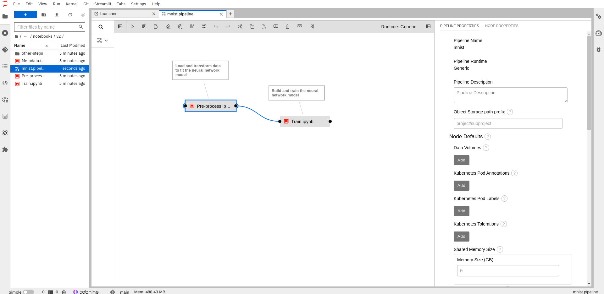
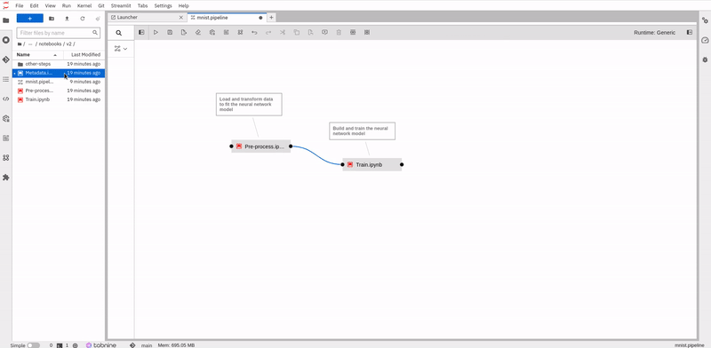
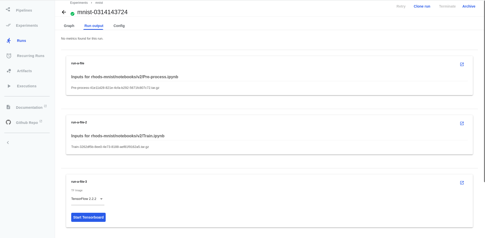
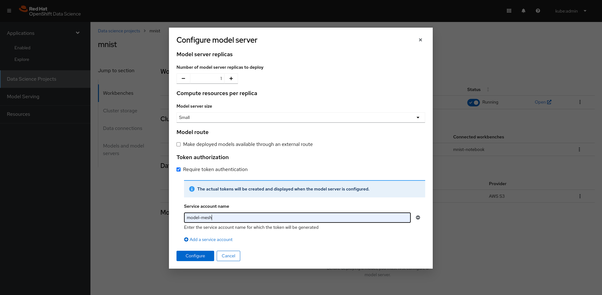
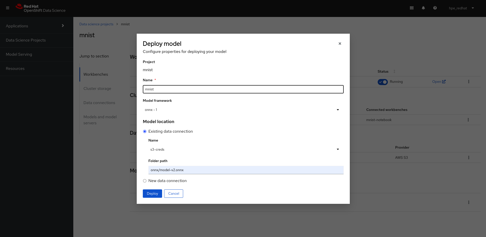
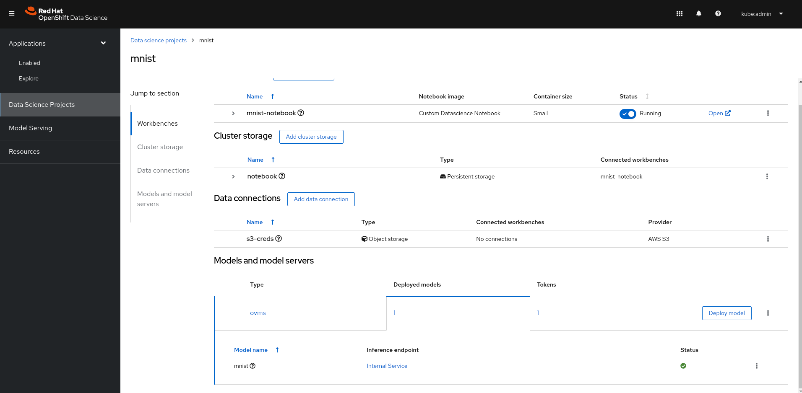

# Lab Instructions

Follow the deployment instructions [here](https://github.com/adrien-legros/rhods-mnist) before running the lab.

## Log in to Red Hat OpenShift Data Science (RHODS)

On the top right of the OpenShift console click on the Application Launcher button and click on the Red Hat OpenShift Data Science (RHODS) managed service. Connect to the RHODS console with an existing user that has admin right on mnist namespace. Note that we might reduce admin permission for that user, but for now let's simplify things.



## Start a new data science project

### Create the workbench

Go to the **Data Science projects** tab and click on the pre-created **mnist** project.



This project has been created with a pvc for the notebook filesystem (i.e the jupyterlab notebooks). It also has a data connection, which is a secret containing the minio credentials for the S3 storage. We will connect those 2 storages to the workbench we are about to create.  
Click on *create workbench* and fill up the form:
- Add a name (we choose *notebook*)
- Select a notebook image
  - **If you have GPU available**, please select: "Custom Datascience Notebook Cuda 11.4" image.
  - **If you have CPU available**, please select: "Custom Datascience Notebook" image.
- Choose a container size (*small* is suffisent in our example)
- Select a persistent storage. Use an existing one and select the one that has been created for you during the lab initialization. (named *notebook*).
- Select a data connection (S3 storage). Use an existing one and select the one that has been created for you during the lab initialization. (named *s3-creds*).

Refer to the bellow example where we deploy a notebook able to use GPU:


RHODS is going to pull a few container images especially the one used for the jupyterlab notebook server. The "Custom Datascience Notebook Cuda 11.4" notebook image is quite heavy (~ 6GB) as it contains the cuda library required to use the GPU in the model training. It can take a few moment for the first pull only (the image is copied in your openshift internal registry). Checkout the notebook status and click on the *open* link.


## JupyterLab notebooks

You are now in the jupyterlab interface.
On the left side click on the git clone button and clone this repository: https://github.com/adrien-legros/rhods-mnist-model.git. 



Navigate to *./notebooks/todo*. Check the following files:

### Notebooks

There are 3 notebooks available: Pre-process, Train and Metadata. Navigate to each of the notebooks to understand what's going on.

#### Pre-process

Load and pre-process the data. The data used to train and test the model are loaded from the minio s3 bucket. In this notebook, we are describing the data and running basic analysis such as counting the number of observation per label. We also transform the data by normalizing and reshaping them. We store the python numpy objects in a bucket so it is available to the others notebooks (i.e available to next pipeline steps).

#### Train

We load the processed data, the we create and train a model. The model is a convolutional neural network. See the architecture of the model and the different layers. Once the model is trained, we test it and display few metrics such as the f1 score or the confusion matrix.  
The model is saved in the minio bucket in onnx format so that we can serve it later on this lab.

#### Metadata

This notebook tells Kubeflow Pipelines to store some metadata. It is specific for the piepline and decoupled from the other notebooks so that the data scientist work is independant of the pipeline configurations.

### Elyra pipeline

Display the pipeline by openning the file *mnist.pipeline*.
It is a pipeline generated thanks to Elyra visual editor. You can see how the notebooks are linked together. Note that you will have to add the 3rd step, or check the solution directory.
If you right click on a "node" you can open the properties tab. You can check that there are some envrionemental variables referenced by a secret name and key. The environment variables are passed to the notebook so it can store artifacts to the minio S3 bucket. We will store some processed data as well as the model in onnx format.  
See also that we need to reference a Runtime Image where the python code will run. You will have to choose the runtime image, depending if you selected the CUDA notebook image or not.

## Complete and run the pipeline

### Select the appropriate runtime image

Open the pipeline properties panel by clicking on the *Open Panel* button, or right clicking to a node, select *Open Properties* and switch tab to *Pipeline Properties*.



Change the default pipeline runtime:
- **For GPU user**: Ensure the "Custom Runtime for mnist : CUDA11.4/Py38" runtime image is selected
- **For CPU user**: Ensure the "Custom Runtime for mnist : Py38" runtime image is selected

The warning will disapear as soon as you selected the image runtime.

### Add a pipeline step

You are going to add the metadata playbook to the pipeline. Open the *mnist.pipeline* file. You can add a step by grabbing a playbook from the file browser to the UI. See the animation bellow. Add the *Metadata.ipynb* notebook. Then bind it to the ouput of the *Train.ipynb* step. Open the *Metadata.ipynb* node properties by right clicking on the object. Add the following property: 
- Output Files: Add *tmp/logs/fit/* as output files. This path is used to store Tensorflow logs in the pipeline metadata. We will be able to visualize our logs through a Tensorboard.  

Additionnaly, confirm that environmental variables has been set by default.



### Add Kubeflow Runtime

We need to setup the Kuflow Runtime so that Elyra can trigger Kubeflow Pipeline API to create an experiment and run it. On the left navigation bar, click on Runtimes. Add a new Kubeflow Pipeline runtime configuration. You will need the Kubeflow API endpoint as well as the Minio endpoint and credentials. To get the endpoints, go to **Administrator Console > Networking > Routes** in the *redhat-ods-applications* namespace. Or run the commands:
```shell
echo MINIO_ENDPOINT: http://$(oc -n redhat-ods-applications get route minio -ojsonpath='{.status.ingress[0].host}')
echo KUBEFLOW_API_ENDPOINT: http://$(oc -n redhat-ods-applications get route ds-pipeline -ojsonpath='{.status.ingress[0].host}')
```
Select Tekton as Pipeline engine and *rhods* as the bucket name. COS username is minio and password is minio123.
Fill up the form as shown in the screenshots:


Save and close the tab.

### Run the pipeline

Go back to the pipeline and run it.


## Navigate to Kubeflow Pipeline

Go to **Administrator Console > Networking > Routes** in the *redhat-ods-applications* namespace. Open the *ds-pipeline-ui* url to open Kubeflow Pipeline. Alternatively, get the url with:
```shell
echo https://$(oc -n redhat-ods-applications get route ds-pipeline-ui -ojsonpath='{.status.ingress[0].host}')
```
Navigate to the **Runs** tab. A new run has been launched for you by Elyra. Click on it. You can see a graph with your pipeline steps. The graph is updated step by step so you only see the Pre-process step during the first 1-2 minutes.  
Check out the logs by clicking on a step, then on the log tab.


The pipeline completed after approximatively 5 minutes with the GPU enabled.

Click on the **Run Ouput** tab. Notice that few metadata artifacts has been created throughout the pipeline. By default, you can retrieve all logs in html or ipynb format. Click on a link to redirect to minio bucket.  



Also notice that a tensorboard is availble. We have deployed a visualization server and a custom resource associated. We will use this server to visualize the model metrics by run and compare them.

Go to **Administrator Console > Networking > Routes** in the *redhat-ods-applications* namespace. Open the *my-viewer* url to open the Visualization server. **WARNING:** Don't forget the /tensorboard/my-viewer/ path at the end of the hostname.  
Alternatively, get the url with:
```shell
echo https://$(oc -n redhat-ods-applications get route my-viewer -ojsonpath='{.status.ingress[0].host}')/tensorboard/my-viewer/
```


## Model Serving

Now it is time to serve our model using modelmesh serving. Go back to RHODS dashboard. Click on **Configure server**. Secure the model with a **token authorization**. The token authorization uses oauth proxy as backend. You don't need an external route. Choose *model-mesh* as the service account name. Finally click on configure:



Then click on **Deploy model**. Enter **mnist** as model name. Select **onnx - 1** as model framework. In the *Train.ipynb* notebook we trained and saved a model in the onnx format. We converted a tensorflow model in the onnx format. The onnx model is saved in the minio S3 bucket at the path **onnx/model-v2.onnx**. Let's add **s3-creds** as the data connection and *onnx/model-v2.onnx* as the folder path. Deploy the model. 



Wait for the model deployment to complete. You can now see the model delpoyment status as well as the token associated with the service account created.  
**NOTE:** The service account resource as not been created. The model server has created a service-account-token sercret named *model-mesh* containing the token, certificate etc.




## Interact with the model

### Deploy the serverless function

The goal of this serverless function is to act as a lightweight pre-processing function between the web interface (that acts as a frontend) and the model serving. We need a pre processing function to transform the data drown in the UI that are in png format into a tensor understandable by the model. Recall that we defined our neural network that way:


The ONNX framework is adequation with this architecutre. Therefore the model server is expecting as input a [1, 28, 28, 1] shape tensor nammed *input_1*.  
For more information conerning the serverless function check out the openshift-serverless/functions/app-src directory. The file *preprocessing.py* contains the 2 most important functions:
- process_data: convert the png format to a well shaped tensor
- process_payload: take the template expected by modelmesh serving and add the processed data

Now deploy the serverless function:
```shell
oc apply -k ./openshift-serverless/manifests/
```

## Deploy the webapp

Deploy the frontend web application:

```shell
oc apply -k ./webapp/manifests/
```

Get the route endpoint and visit the url!

```shell
oc -n mnist get route mnist-webapp -ojsonpath='{.status.ingress[0].host}'
```

Draw a digit between 1 and 9. Click on predict and see te ouput. Note: the first prediction can take more time as the serverless function might not be running. The following predictions will be much faster.

## Clean Up

Once you finished and saved all needed files, you can reset the lab by running:
```shell
oc create -f /lab/reset/job.yaml
```