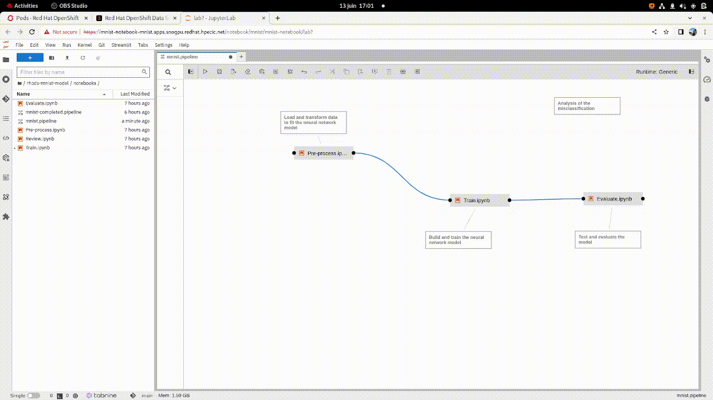

# Lab Instructions

Follow the deployment instructions [here](https://github.com/adrien-legros/rhods-mnist) before running the lab.

## Log in to Red Hat OpenShift Data Science (RHODS)

On the top right of the OpenShift console click on the Application Launcher button and click on the Red Hat OpenShift Data Science (RHODS). Connect to the RHODS console with an existing user with admin rights on mnist namespace.


## Start a new data science project

### Create the workbench

Go to the **Data Science projects** tab and click on the pre-created **mnist** project.


This project has been created with a pvc for the notebook filesystem (i.e the jupyterlab notebooks). It also has a data connection which is a secret containing the minio credentials for the S3 storage. We will connect those 2 storages to the workbench we are about to create.  
Click on *create workbench* and fill up the form:
- Enter *mnist-notebook* as the name.
- Select the notebook image: *Custom Datascience Notebook*.
- Choose a container size (*small* is suffisent in our example)
- Select a persistent storage. Use an existing one and select *notebook*.
- Select a data connection (S3 storage). Use an existing one and select *s3-creds*.

Confirm your configuration with the following screenshots:


Wait until the notebook has the *Running* status. It might take few minutes if the notebook image is not already present in your internal registry:


Click on the **Open** and log in with your Openshift user and password.

## Jupyter Notebooks

You are now in the Jupyter interface.
On the left side click on the git clone button and clone this repository: https://github.com/adrien-legros/rhods-mnist-model.git. 


Navigate to *./rhods-mnist-model/notebooks/*. Check the following files:

### Files

There are 4 notebooks and 1 pipeline available. Navigate to each of the notebooks.

#### Pre-process

Load and pre-process the data. The data used to train and test the model are loaded from the minio s3 bucket. In this notebook, we are describing the data and running basic analysis such as counting the number of observation per label. We also transform the data by normalizing and reshaping them. Pre-processed data are stored into numpy objects on the local filesystem. Later on when we will create the Elyra pipeline, we will add a persistent volume so data will be available to the others notebooks (i.e available to next pipeline steps).

#### Train

We load the processed data, create and train a model. The model is a convolutional neural network. See the architecture of the model and the different layers. The Tensorflow model is converted into ONNX format and then saved into the S3 bucket. Look for the comment to see the convertion and upload cell.

#### Evaluate

Retrieve and test the saved model. Declare prediction score so it is available through output metadata in kubeflow pipeline.

#### Review

Analyse misclassification

#### Data science pipeline

Display the pipeline by openning the file *mnist-completed.pipeline*.
It is a pipeline generated thanks to Elyra visual editor. You can see how the notebooks are linked together.
If you right click on a "node" you can open the properties tab. You can check that there are some envrionemental variables referenced by a secret name and key. The environment variables are passed to the notebook so it can store artifacts to the minio S3 bucket.
See also that we need to reference a Runtime Image used to run the python code.

## Elyra Pipeline

In this section you will modify the *mnist.pipeline* to add the *Review* step. You can compare your work with the *mnist-completed.pipeline*

### Add a pipeline step

Open the *mnist.pipeline* file. You can add a step by grabbing a playbook from the file browser to the UI. See the animation bellow. Add the *Review.ipynb* notebook to the pipeline. Link it to both *Pre-process.ipynb* and *Train.ipynb*.



### Review and add properties

Right click on the Review step and open the properties panel. Note that the default runtime image is already selected and will be used to execute your notebook inside a container on Openshift.

We need to pass the processed data to the *Review.ipynb* notebook. We will use a volume to share data between pipeline steps. *Pre-process.ipynb* will write data to this volume and *Review.ipynb* notebook will read data from it.

Open the node properties menu, scroll down to *Data Volumes*. Add a new volume and complete the following information:

- **Mount Path**: /tmp/ml-pipeline
- **Persistent Volume Claim Name**: ml-pipeline

### Add the Kubeflow Runtime

We need to add a Kuflow Runtime so Elyra can trigger Kubeflow Pipeline API to run a data science pipeline. On the left navigation bar, click on Runtimes icon. Create a runtime as follow:

First get you public kubeflow pipeline endpoint by either looking into administration dashboard > **Networking** > **Routes** > **ds-pipeline-ui-ds-pipeline** or running the command: 
```shell
echo https://$(oc -n mnist get route ds-pipeline-ui-ds-pipeline -ojsonpath='{.spec.host}')
```
Replace *MY_KFP_ENDPOINT* in the following section with this value.

(Optionnal) Secondly get your public cloud object storage endpoint by either looking into administration dashboard > **Networking** > **Routes** > **minio** or running the command: 
```shell
echo https://$(oc -n mnist get route minio -ojsonpath='{.spec.host}')
```
Replace *MY_S3_ENDPOINT* in the following section with this value.

- **Display Name**: Kubeflow Runtime
- **Kubeflow Pipelines API Endpoint**: http://ds-pipeline-ds-pipeline.mnist.svc.cluster.local:8888
- **Public Kubeflow Pipelines API Endpoint**: MY_KFP_ENDPOINT
- **Kubeflow Pipelines engine**: Tekton
- **Cloud Object Storage Endpoint**: http://minio-ds-pipeline.mnist.svc.cluster.local:9000
- **Public Cloud Object Storage Endpoint**: MY_S3_ENDPOINT
- **Cloud Object Storage Bucket Name**: rhods
- **Cloud Object Storage Authentication Type**: USER_CREDENTIALS
- **Cloud Object Storage Username**: minio
- **Cloud Object Storage Password**:  minio123


### Run the pipeline

Go back to mnist.pipeline. Click on the run button. Choose *Kubeflow Pipelines* as the Runtime Plateform. Then click OK. 


Click on the *Run Details* link to go to Kubeflow Pipeline dashboard. This dashboard enables you to see your pipeline runs.


## Navigate to Kubeflow Pipeline

Once in the Kubeflow Pipeline dashboard navigate to the **Runs** tab. A new run has been launched for you by Elyra. Click on it. You can see a graph with your pipeline steps.  
Check out the logs by clicking on a step, then on the log tab.


The pipeline completed after approximatively 5 minutes.

Click on the **Run Ouput** tab. Notice that few metadata artifacts has been created throughout the pipeline. By default, you can retrieve all logs in html or ipynb format. Click on a link to redirect to minio bucket.  


### Compare run

You can run several time the pipeline and compare results. Create a new run from the Elyra UI on Jupyter Notebook. Wait until the run completes. Then select models to compare and click on *Compare Runs*


## Model Serving

We will serve the model using modelmesh serving. Go back to RHODS dashboard. Click on **Configure server**. Secure the model with a **token authorization**. The token authorization uses the oauth proxy as backend. Optionnally create an external route. Choose *model-mesh* as the service account name. Finally click on the configure button:


Then click on **Deploy model**. Enter **mnist** as model name. Select **onnx - 1** as model framework. In the *Train.ipynb* notebook we trained and saved a model in the onnx format. We converted a tensorflow model in the onnx format. The onnx model is saved in the minio S3 bucket at the path **onnx/model-v2.onnx**. Let's add **s3-creds** as the data connection and *onnx/model-v2.onnx* as the folder path. Deploy the model. 


Wait for the model deployment to complete. You can now see the model delpoyment status as well as the token associated with the service account created.  
**NOTE:** The model server created a service-account-token secret called *model-mesh* containing the bearer token needed for the authentication.


## Interact with the model

### Deploy the webapp and the serverless function

The goal of this serverless function is to act as a lightweight pre-processing function between the web interface (that acts as a frontend) and the model serving. We need a pre processing function to transform the data drawn in the UI that are in png format into a vector understandable by the model. Recall that we defined our neural network that way:


The model server is expecting as input a [1, 28, 28, 1] shape tensor nammed *input_1*.  
For more information conerning the serverless function check out the openshift-serverless/functions/app-src directory. The file *preprocessing.py* contains the 2 most important functions:
- process_data: convert the png format to a well shaped tensor
- process_payload: take the template expected by modelmesh serving and add the processed data

See also ./inference/openshift-serverless/manifests/service.yaml. Note that we specify as environment variable the name of the service account created previously so our serverless function can authenticate to the model server.

Deploy the serverless function and the frontend web application:
```shell
oc apply -k ./inference/
```

Get the route endpoint and visit the url!

```shell
echo http://$(oc -n mnist get route mnist-webapp -ojsonpath='{.status.ingress[0].host}')
```

Draw a digit between 1 and 9. Click on predict and see te ouput. Note: the first prediction can take more time as the serverless function might not be running. The following predictions will be much faster.