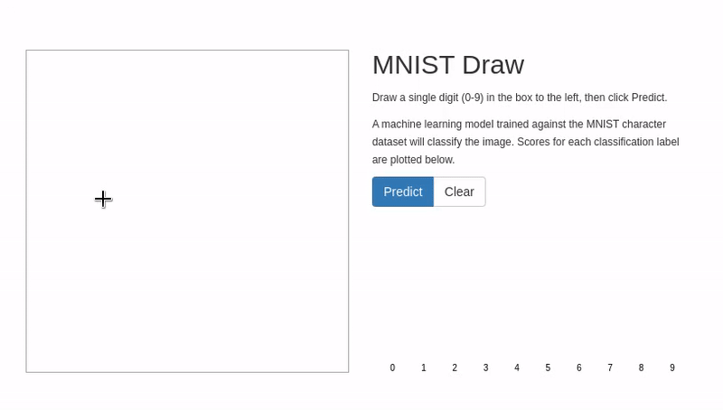

# Walkthrough

## Workbench creation

Go to RHODS dashboard. Login with Openshift. Possible highlights:

- How to configure Jupyter Notebooks
- How to create and link persistent and bucket storage

## Jupyter notebooks

From the RHODS dashboard, open the jupyter notebooks. Login with Openshift. Possible highlights:

- Create and run a pipeline with Elyra
- Create and run a pipeline using KFP tekton sdk
- Commit your code to the local gitea instance

## MLOps automation

Find the gitea route on the gitea namespace. Log in with ```data-scientist-1``` / ```rhods```. 

- Create a new pull request and merge to the prod branch This will trigger the Openshift pipeline and the data science pipeline
- See the pipeline running on RHODS dashboard
- Wait for competion
- Show the tagged model in the object storage (stored under rhods/onnx/model-TAG.onnx)
- Show the metrics directly on the pull request comment or on the mlflow dashboard (mlflow instance is deployed on mlflow namespace)

## Model serving

Go back to rhods dashboard
- Configuring a model server with route and or authentication
- Model deployment. It is pointing to the versionned model tagged *prod* 

## Live inference

On mnist namespace, find the webapp route and open the frontend. Draw a digit to make a prediction. Optionnaly explain the goal of the serverless function as a pre processor for the HTTP requests made by the frontend.



## Camel integration

You can explain the 2 camel integrations. You can highlight:

- The minio to kafka inteagration (using KamelBinding)
- The KafkaSource that triggers the serverless function on a new event
- The kafka to SQL inteagration (using Integration)

## Batch inference

Open the Grafana dashboard. The route is on the mnist namespace. Open the Inference dashboard. Log in with ```admin``` / ```rhods```
- Add images from the ./test/batch/images to the *images* bucket
- You can also use the ./test/batch/push-minio.sh script but it requires the mb cli from minio
- On grafana see the images processed in real time