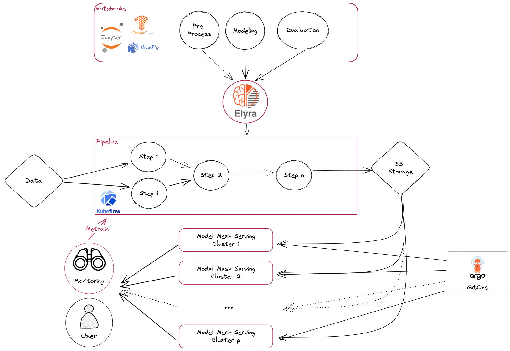

# MLOps with RHODS

This aims to deploy model mesh servers in different namespaces using Openshift Gitops.

## Deploy

```shell
oc apply -k ./gitops/argocd/
```

## Test

```shell
curl --insecure --silent -X POST -d @gitops/test/body.json https://$(oc -n model-serving-prod get route mnist -ojsonpath='{.status.ingress[0].host}')/v2/models/mnist/infer | jq
```

## Schema



## Clean

```shell
oc delete -f ./gitops/argocd/argocd/applicationset.yaml
oc delete -f ./gitops/argocd/openshift/namespace.yaml
```

## Notebooks

https://github.com/adrien-legros/rhods-mnist-model